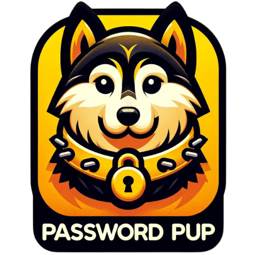

# Password Generator Chrome Extension


## Description

This Password Generator Web App provides users with a secure and customizable way to generate passwords. 
git 
## Features

- **Customizable Word Input**: Users can input their favorite word(s) to be included in their password.
- **Character Selection**: Through checkboxes, users can select to include symbols, numbers, uppercase letters, and lowercase letters in their passwords.
- **Password Length Slider**: A slider allows users to decide the length of their password.
- **Real-Time Password Generation**: As options are selected, the password updates in real-time.
- **Strength Indicator**: A fun emoji-based strength indicator provides feedback on the security level of the generated password.
- **Copy Functionality**: Users can copy their new password to the clipboard with one click.
- **Regenerate Option**: A refresh button enables users to create a new password based on the same criteria.

## Installation

1. Clone the repository:
   ```sh
   git clone https://github.com/your-username/password-generator-extension.git

## Acknowledgements

- [Bootstrap](https://getbootstrap.com/)
- [React](https://reactjs.org/)